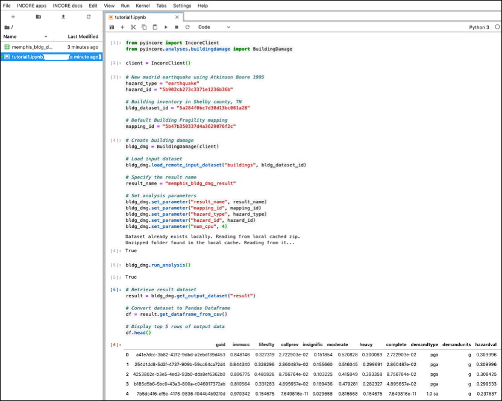

## IN-CORE Lab

A user can run and edit Jupyter Notebooks interactively in IN-CORE Lab. You can access IN-CORE Lab at https://incore.ncsa.illinois.edu. The IN-CORE Lab is a customized [Jupyter Lab](https://jupyterlab.readthedocs.io/en/stable/#) with **pyIncore** installed on the Linux server.

When you access it, you might see a button to **Start My Server** followed by a progress bar.

Main Incore Lab's dashboard tab:

### Running a Notebook in the Lab

In the [Running Notebook locally](../running) section we described how to run a Building Damage Notebook locally as an example, but you can develop and run all sorts of notebooks as you explore. 
The following section focuses on **step-by-step instructions** of running Notebooks on the IN-CORE Lab.

1. Upload the Building Damage Analysis notebook from your local machine to IN-CORE lab by clicking the `Upload` icon in the left panel and select **building_dmg.ipybn**.

2. The Notebook shows up in the left panel after a successful upload.

3. Double click to open the Notebook in the main area and run it. For instructions on how to run a **Building Damage Analysis**, please refer to the previous section [Running Notebook locally](../running).

### Accessing IN-CORE Web Tools

This section shows user how to access [IN-CORE Web Tools](webtools) on IN-CORE Lab. The IN-CORE Lab is a customized Jupyter Lab with `INCORE Login` button in the main window and two IN-CORE-related menus, `INCORE apps` and `INCORE docs`.

1. Click on `INCORE Authenticator` button in the main window. 

2. The Fragility, Data and Hazard Explorers under `INCORE apps` menu become enabled after pressing the `LOGIN` button 

The [IN-CORE Web Tools](webtools) Viewers become part of INCORE Lab as shown below for the Fragility viewer.

### IN-CORE documentation

For ease of access, documentation is easily accessible from IN-CORE Lab.

The second IN-CORE menu, `INCORE docs` allows the user to see **pyIncore** documentation and API endpoints definitions for accessing Fragility, Data and Hazard server(s).

