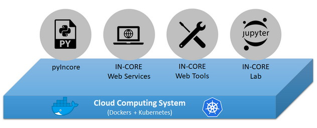

Introduction
============

..  toctree::
    :hidden:
    :maxdepth: 2
    :caption: Table of Contents
    :name: mastertoc

    self
    account
    getting_started
    pyIncore <pyincore>
    pyIncore-viz <pyincore_viz>
    incore_lab
    webtools
    tutorials
    FAQ <faq>
    notebooks
    refs
    links
    contact
    acknowledgement

The National Institute of Standards and Technology (NIST) funded the Center of Excellence for Risk-Based Community
Resilience Planning (`CoE <http://resilience.colostate.edu/>`_) (Cooperative Agreement 70NANB15H044), to develop the measurement science to support
community resilience assessment. The measurement science is implemented on a platform called |INCORE| (**INCORE**). It incorporates a risk-based approach
to decision-making that enables quantitative comparisons of alternative resilience strategies.
On the IN-CORE platform, data from the community can be seamlessly integrated which allows users to optimize
community disaster resilience planning and post-disaster recovery strategies intelligently using physics-based
models of inter-dependent physical systems combined with socio-economic systems.

IN-CORE consists of multiple components as shown below:

**pyIncore**  is a Python package consisting of three primary components: 1) a set of service classes to interact
with the IN-CORE web services described below, 2) IN-CORE analyses and 3) visualization. The pyIncore allows users
to apply various hazards to infrastructure in selected areas, propagating the effect of physical infrastructure
damage and loss of functionality to social and economic impacts. Refer to `pyIncore section <pyincore.html>`_ for detailed information.

**IN-CORE Web Services** are written in Java with JAX-RS specification and are comprised of a Hazard Service,
DFR3 (Damage, Functionality, Repair, Recovery, Restoration) Service, Data Service, Geospatial Visualization
Service, Semantic Service, and Space Service. These services allow users to create and access hazards, fragilities
and data. Users can access and utilize these services via pyIncore and IN-CORE Web Tools. For detailed information,
please refer to the `technical reference document <https://incore.ncsa.illinois.edu/doc/api/>`_.

**IN-CORE Web Tools** is a set of web viewers for interacting with the different IN-CORE web services.
The viewers enable users to browse, search **Datasets**, **Hazards**, **Fragility curves**, **Repair curves**, etc.,
view the metadata and visualizations, and download items allowed.  For detailed information, please refer
to the `IN-CORE Web Tools section <webtools.html>`_.

**IN-CORE Lab** is a customized Jupyter Lab with **pyIncore** installed and hosted on a NCSA cloud system.
It allows users to develop/run/test their scientific model with pyIncore in their own workspace.
Example Jupyter notebooks are provided with each pyincore analysis to help users get started and to help them
understand how to use the pyIncore.  For detailed information, please refer to the `IN-CORE Lab section <incore_lab.html>`_.

Below you can find two Jupyter notebook `research examples <notebooks.html>`_ that demonstrate IN-CORE:
1) `Joplin testbed <notebooks/Joplin_testbed/Joplin_testbed.html>`_ :download `Joplin_testbed.zip <https://github.com/IN-CORE/incore-docs/blob/master/notebooks/Joplin_testbed.zip>`_.
2) `Seaside testbed <notebooks/Seaside_testbed/Seaside_testbed.html>`_ :download `Seaside_testbed.zip <https://github.com/IN-CORE/incore-docs/blob/master/notebooks/Seaside_testbed.zip>`_.
You can download and run each Jupyter notebook to see how IN-CORE is utilized and see the results from each testbed.

.. |INCORE| raw:: html

   <b>I</b>nterdependent <b>N</b>etworked <b>Co</b>mmunity <b>R</b>esilience Modeling <b>E</b>nvironment

