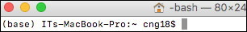

## Prerequisites

- **IN-CORE Account**
    A user must have an **IN-CORE** account. If you do not have it, see [IN-CORE Account](account) section for setting one.

- **Virtual environment**
    We recommend that users get familiar with Python virtual environment managers called [Anaconda](https://www.anaconda.com/) or [Miniconda](https://docs.conda.io/en/latest/miniconda.html).

    * These are tools that help keep dependencies separate for different projects. If you decide, however, to use 
    a virtual environment or manager you must do it now, in this prerequisite step.

    * Environment managers are available by downloading OS specific installers. Note that Anaconda/Miniconda 
    distribution will include Python (Anaconda also includes a collection of over 1,500+ open source packages), so installing Python first is not needed if you use Anaconda/Miniconda. With Anaconda you already have installed Jupyter Notebook. The `conda` is the preferred interface for managing installations and virtual environments with the Anaconda/Miniconda Python distribution.

- `Python 3.5+` <https://www.python.org/>
    It is common to have more than one Python version installed on your computer. Make sure you are running 
    the correct, Anaconda version of Python.

- `Jupyter Notebook` <https://jupyter.org/>
    We recommend using Jupyter Notebook for running the **pyIncore** projects. It as an open-source application 
    that allows you to create projects (documents) that contain live Python code, visualizations and documentation. 
    Jupyter Notebook is already installed with Anaconda distribution; it has to be installed separately 
    in your virtual environment on Miniconda distribution.

In the Installation section we provide instructions for environment manager using [Miniconda](https://docs.conda.io/en/latest/miniconda.html). Similar instructions apply to full [Anaconda](https://docs.anaconda.com/anaconda/install/) manager. Python 3.x is installed with both versions. The following instructions were tested for Mac, Windows and Linux 64-bit OS.

### Windows 64-bit

1. Download the latest Miniconda3 installer for Windows from the [Miniconda](https://docs.conda.io/en/latest/miniconda.html) web page.

2. Run the installer setup locally (select the *Just Me* choice) to avoid the need for administrator privileges.

3. Leave the default folder path (`C:\Users\<user>\..\miniconda3`).

4. Do not add Anaconda to the PATH. Do, however, register Anaconda as the default Python environment.

5. Open up an Anaconda prompt from the Windows Start menu. The `base` environment is being activated and the prompt changes to: `(base) C:\Users\<user>`:

    


6. Create the python environment (`pyincoreEnv` for example) and activate it (or stay in the `base`):
    ```
    conda create -n pyincoreEnv python=3
    conda activate pyincoreEnv
    ```

7. Add [conda-forge](https://conda-forge.org/) package repository to your environment:
    ```
    conda config --add channels conda-forge
    ```

### Mac and Linux OS

1. Download the latest Miniconda3 installer from the [Miniconda](https://docs.conda.io/en/latest/miniconda.html) web page.

2. Run the installer setup locally (select the *Install for me only* on Mac/Linux) to avoid the need for administrator privileges.

3. Leave the default folder path (`/Users/<username>/miniconda3` or `/home/<username>/miniconda3`).

4. Do not add Anaconda to the PATH. Do, however, register Anaconda as the default Python environment.

5. Open up a Terminal. The `base` environment is being activated and the prompt changes to: `(base)/Users/<username>` or `(base)/home/<username>`:

6. Create the python environment (`pyincoreEnv` for example) and activate it (or stay in the `base`):
    ```
    conda create -n pyincoreEnv python=3
    conda activate pyincoreEnv
    ```

7. Add [conda-forge](https://conda-forge.org/) package repository to your environment:
    ```
    conda config --add channels conda-forge
    ```
   
   
#### Install Anaconda manager

1. Download the latest Anaconda3 installer for your operating system from the [Anaconda](https://www.anaconda.com/distribution/) web page. 
Choose Python 3.7 version.

    Following three steps might differ slightly on your system. For up-to-date installation follow 
    Anaconda's documentation, chapters [Installing on Windows](https://docs.anaconda.com/anaconda/install/windows/), [Installing on macOS](https://docs.anaconda.com/anaconda/install/mac-os/) and 
    [Installing on Linux](https://docs.anaconda.com/anaconda/install/linux/).
    Various installation options are summarized in Anaconda's [Frequently asked questions](https://docs.anaconda.com/anaconda/user-guide/faq/#distribution-faq-windows-folder).

2. Run the installer setup locally if asked (select *Just Me* choice on Windows OS or *Install for me only* on Mac/Linux OS) 
to avoid the need for administrator privileges. 

3. Leave the **default** folder path. For your information, the default path is `C:\Users\<username>\anaconda3` on Windows, 
`/Users/<username>/opt/anaconda3` on Mac (or `~/opt` for the graphical install) and `/home/<username>/anaconda3` on Linux.

4. Do not add Anaconda to the PATH. Do, however, register Anaconda as the default Python environment.

5. Activate the environment:
    * On Windows, open up an Anaconda prompt from the Windows Start menu. The `base` environment is being activated and the prompt changes to: `(base) C:\Users\<user>`:

        

    * On Mac/Linux, open up a Terminal. The `base` environment is being activated and the prompt changes to: `(base)/Users/<username>` or `(base)/home/<username>`:

        

6. Create the Python environment (for this example we choose `mypyincore`) and activate it:
    ```
    conda create -n mypyincore python=3.7
    conda activate mypyincore
    ```
    You should see `mypyincore` in parenthesis before the command prompt, meaning you set up the new virtual environment and are now using it.

7. Add [conda-forge](https://conda-forge.org/) package repository to your environment:
    ```
    conda config --add channels conda-forge
    ```

#### Install pyIncore package

1. Navigate to the directory you want to use for developing your code in Jupyter Notebooks and run the following command in your **activated** environment:
	```
	conda install -c in-core pyincore
	```

	To check that the package is installed, run
	```
	conda list pyincore
	```
 
2. Start local Jupyter Notebook by running the following command in the terminal or command prompt, from your **Project folder**. Jupyter Notebook is already installed 
with Anaconda distribution:
	```
	jupyter notebook
	```
   
	A message *The Jupyter Notebook is running* appears in the terminal/prompt and you should see the notebook open in your browser. 
	If a web browser doesn't open automatically, you can copy/paste a token into browser's navigation bar.
    
	

	If you see an error message *jupyter: command not found** launch Notebook through **Anaconda Navigator**, a desktop graphical user interface (GUI) 
	which lets you launch Anaconda applications.
	
	Find Anaconda Navigator using `Start Menu - Anaconda Navigator` or Search bar on Windows, or directly in the Applications folder on Mac. 
	Choose your environment (**mypyincore** in this example) from the `Applications On` pull down menu in the Navigator's dashboard, install 
    Jupyter Notebook and start it by clicking a **Launch** button.
    
 	
   
3. Create an new Jupyter Notebook (with Python 3), name it **Tutorial_1.ipynb** 

	

4. Add codebase of the analysis by following steps **1 through 8** from previous section [Using pyIncore in IN-CORE Lab](#pyincorelab).

	

5. Again, your web page should show multiple cells of code. To execute cells one by one select the first cell and click the **Run** button at the top.

	Please note, you might get warning *Matplotlib is building the font cache using fc-list. This may take a moment.*

    A **memphis_bldg_dmg_result.csv** file will appear after a short time in the file tab.	

	

### Useful links

* Anaconda: [Installing on Windows](https://docs.anaconda.com/anaconda/install/windows/), [Installing on macOS](https://docs.anaconda.com/anaconda/install/mac-os/) and 
[Installing on Linux](https://docs.anaconda.com/anaconda/install/linux/), and [Frequently asked questions](https://docs.anaconda.com/anaconda/user-guide/faq/#distribution-faq-windows-folder)

* A [Beginner’s Guide](https://medium.com/@neuralnets/beginners-quick-guide-for-handling-issues-launching-jupyter-notebook-for-python-using-anaconda-8be3d57a209b) to installing Jupyter Notebook using Anaconda distribution. 
Opening a Jupyter [Notebook on Windows](https://problemsolvingwithpython.com/02-Jupyter-Notebooks/02.04-Opening-a-Jupyter-Notebook/).

* For details on running and manipulating `ipynb` files refer to [Jupyter documentation](https://jupyter.readthedocs.io/en/latest/running.html#running). 
If you have problems running Notebooks, check our [WIKI questions](https://opensource.ncsa.illinois.edu/confluence/display/INCORE1/questions/all) page or contact us at [incore-dev@lists.illinois.edu](mailto:incore-dev@lists.illinois.edu).

* IN-CORE Lab extends Jupyter Lab. See [Jupyter Lab](https://jupyterlab.readthedocs.io/en/stable/) and [blog](https://blog.jupyter.org/jupyterlab-is-ready-for-users-5a6f039b8906) for more information.

* IN-CORE's Frequently Asked Questions ([FAQ](faq)) and [WIKI Questions](https://opensource.ncsa.illinois.edu/confluence/display/INCORE1/questions/all)) for detail information. 

* The Building analysis Jupyter Notebook is also available at [IN-CORE project](https://github.com/IN-CORE/incore-docs/blob/master/notebooks/bridge_dmg.ipynb) on GitHub.
   
   


