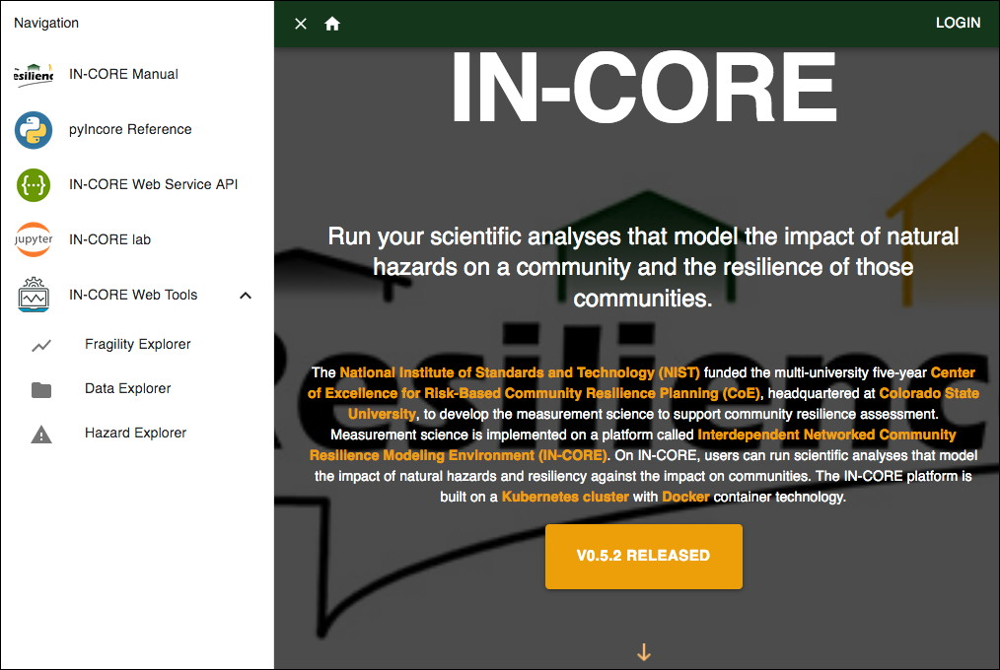

## IN-CORE Web Tools

**IN-CORE Web Tools** is a set of web viewers for interacting with the different IN-CORE web services. 
The viewers enable users to browse, search, preview, and download items, such as **Datasets**, **Hazards**, 
and **Fragility** curves. Note that curves of Repairs, Restorations and Recoveries currently are not searchable. 
A future version of Web Tools will enable those information.
There are three web tools: 1) **Data viewer**, 2) **Hazard viewer**, and 3) **Fragility viewer**. 
Each viewer interacts with IN-CORE web services respectively: 1) Data service, 2) Hazard service, 
and 3) DFR3 (Damage, Functionality, Repair, Restoration, Recovery) service. These viewers can be accessed 
directly from the [IN-CORE](https://incore2.ncsa.illinois.edu/) page

 
 
 or from the [IN-CORE Lab](https://incore.ncsa.illinois.edu/lab).
 
<!-- -->
 
This section shows how to access and use IN-CORE Web Tools.

Users must login with their IN-CORE username and password in order to access the viewers:

This section shows how to access IN-CORE Web Tools and documentations on IN-CORE Lab.

### Fragility Viewer

The [Fragility Viewer](https://incore2.ncsa.illinois.edu/FragilityViewer) shows a list of 
Fragility curves in the left panel. The list comes from **DFR3 service**.

Users can filter the list by selecting Hazards and types of structures in the drop down lists. 
The curve can be viewed and the metadata of the curve can be downloaded in JSON format.

### Data Viewer

In [Data viewer](https://incore2.ncsa.illinois.edu/DataViewer) users can navigate datasets 
along with their metadata and preview (visualization) such as building inventory, bridge 
inventory, etc. 

### Hazard Viewer

In [Hazard viewer](https://incore2.ncsa.illinois.edu/HazardViewer) users can navigate 
pre-defined Hazards with a user interface similar to what has been shown for the other 
viewers. Users can filter the list of hazards by selecting them from the drop down lists.

A hazard can be visualized if it has associated geospatial information, such as **shapefile** or **geotiff**. 
The following shows an example of a preview of a Joplin tornado path.

