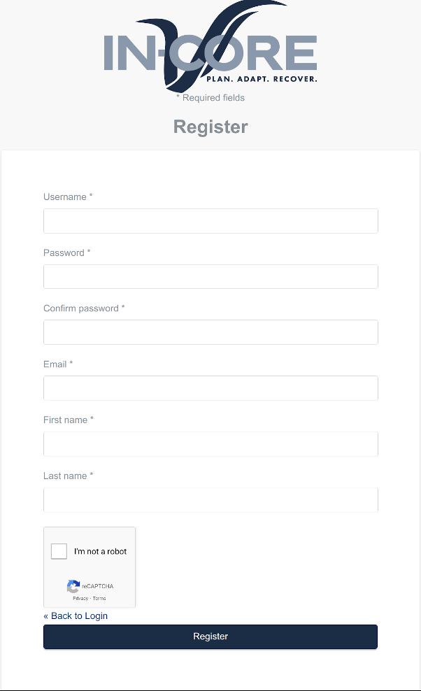

# IN-CORE Account

Access to the **IN-CORE** service requires a user account. Registering for an account is free and open to everyone.
This account gives you access to all of the public data on the system and allows you to create data that is only
accessible by you. If applicable, it is recommended that you sign up with your institutional email.
To register for an account, please go to:

[https://incore.ncsa.illinois.edu/auth/realms/In-core/login-actions/registration?
client_id=react-auth](https://incore.ncsa.illinois.edu/auth/realms/In-core/login-actions/registration?client_id=react-auth)

After you register, you will receive an email to finish your registration process. Once this is complete, an
administrator will need to activate your account before you can access IN-CORE.

