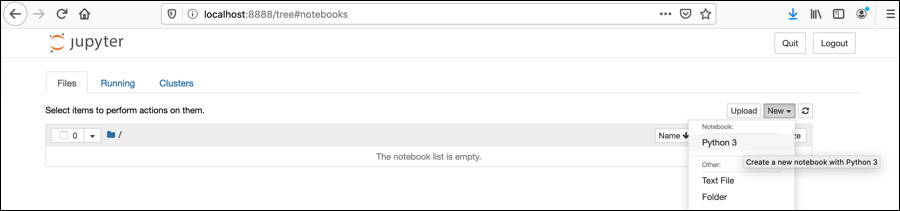
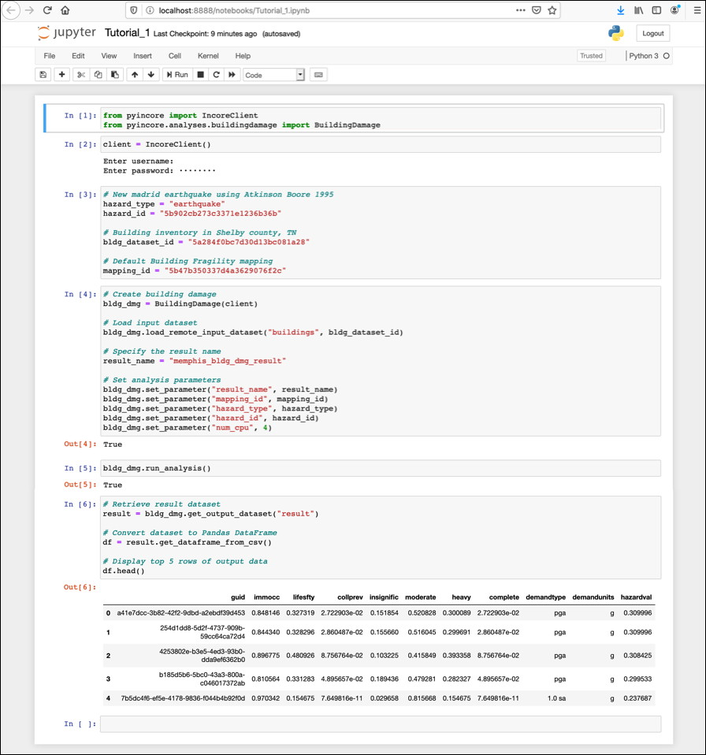
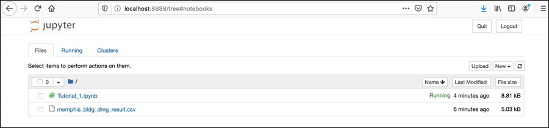

# Getting Started

This page is an overview of the **IN-CORE** and **pyIncore** documentation and related resources.

**IN-CORE** is a platform that enables quantitative comparisons of alternative resilience strategies.
On the platform, data from the community can be seamlessly integrated which allows users to optimize
community disaster resilience planning and post-disaster recovery strategies intelligently using physics-based
models of inter-dependent physical systems combined with socio-economic systems.

**pyIncore** is a Python project and module to analyze and visualize various hazard (earthquake, tornado, hurricane etc.) 
scenarios. Python framework accesses underlying data and interacts with them through remote services and facilitates 
moving and synthesizing results, it can also be used to develop scientific analysis and algorithm.

## Introduction to IN-CORE platform

On the IN-CORE platform, users can run analyses that model the impact of natural hazards and community resilience 
and recovery. The platform consists of IN-CORE Lab, pyIncore, Web tools, and Web services. Resources such as Inventory datasets, Fragilities, 
Hazard files etc. provided by the research community are stored on NCSA's IN-CORE 
servers, and they can be seamlessly integrated to allow users to optimize community disaster resilience planning and 
post-disaster recovery strategies.

In this Tutorial, we will create a Building damage script for a specific testbed by calling pyIncore’s core analysis module **BuildingDamage**. We will be running the Notebook interactively, first in NCSA's [IN-CORE Lab](incore_lab) and then on your local computer.

A user must have an IN-CORE account recognized by the IN-CORE service. This account gives you access to all of the public data on
the system and allows you to create data that is only accessible by you. See [IN-CORE Account](account) section for creating one.

## Using pyIncore locally

In this section we will create and run our first analysis using Jupyter Notebook and pyIncore library, both run locally on your computer. 
We will re-create Building Damage analysis. The result will be a comma-delimited (csv) text file with Building inventory and Damage states for each individual building.

Apart from your IN-CORE Account you need:

* Python virtual environment called **Miniconda**
* **Jupyter Notebook** and
* **pyIncore** library

For this **Getting started** example we use small Python environment manager Miniconda which
includes just Python, conda, and a small number of other packages. We will install Jupyter Notebook separately. 
For additional installation details see [prerequisites](pyincore/prerequisites.md) page.

### Install pyIncore package - quick reference

If you already have Miniconda (or Anaconda) installed update `conda`, an interface for managing installations and virtual 
environments shared by both Miniconda and Anaconda, using `conda update conda` command and continue with step 3. 
If you don't have Miniconda installed, do the following steps. 

1. Download the latest Miniconda3 installer from the [Miniconda](https://docs.conda.io/en/latest/miniconda.html) web page. 


2. From the Terminal (Mac/Linux) or Command Prompt (Windows) add [conda-forge](https://conda-forge.org/) package repository/channel to your environment:
    ```
    conda config --add channels conda-forge
    ```
   
3. Create the python environment (for this example we choose `pyincoreEnv`):
    ```
    conda create -n pyincoreEnv python=3.9
    ```
   
4. Activate the environment:
    ```
    conda activate pyincoreEnv
    ``` 
   
5. To install pyIncore, navigate to the directory you want to use for running Jupyter Notebooks and run the following command:
    ```
    conda install -c in-core pyincore
    ```

   If you have trouble installing pyincore or it is taking a long time to resolve the dependencies, try using the libmamba solver by running the following command:

    ```
    conda install -c in-core pyincore --solver=libmamba
    ```

   A user can also install **pyIncore-viz** module for which **pyIncore** installs as a dependency:
    ```
    conda install -c in-core pyincore-viz
    ```
   Similarly, if you have issues installing pyincore-viz, you can use the libmamba solver flag to resolve the
   dependencies by running the following command:

    ```
    conda install -c in-core pyincore-viz --solver=libmamba
    ```

   The **pyIncore-data** package, available in the in-core conda channel, assists in preparing data for use in 
   **pyIncore**.
    ```
    conda install -c in-core pyincore-data
    ```
   Similarly, you can use the libmamba solver flag to resolve the dependencies by running the following command:

    ```
    conda install -c in-core pyincore-data --solver=libmamba
    ```
   
   If the installed pyincore, pyincore-viz, pyincore-data version is not the latest or lower than the desired one, 
   specify the version number in installation command. e.g.
    ```
    conda install -c in-core pyincore=1.14.0 (or your version of choice)
    ```
   Version information for [pyincore](https://anaconda.org/IN-CORE/pyincore), [pyincore-viz](https://anaconda.org/IN-CORE/pyincore-viz), and [pyincore-data](https://anaconda.org/IN-CORE/pyincore-data) can 
   be found in [Anaconda IN-CORE space](https://anaconda.org/IN-CORE/repo).


6. Install Jupyter Notebook. Jupyter Notebook is already installed with Anaconda distribution; it has to be installed separately in your virtual environment on Miniconda:
    ```
    conda install jupyter
    ```
   
### Running Jupyter Notebook
   
1. Start local Jupyter Notebook by running the following command in the terminal or command prompt, from your **Project folder**:
    ```
    jupyter notebook
    ```
   
    A message *The Jupyter Notebook is running* appears in the terminal/prompt and you should see the notebook open in your browser. 
    If a web browser doesn't open automatically, you can copy/paste a token into browser's navigation bar.
    
    
    <br />
    <br />
2. Create a new Jupyter Notebook, name it **Tutorial_1.ipynb** 

    
    <br />
    <br />
3. In the Notebook's upper cell type, or copy and paste following code:
    ```
    from pyincore import IncoreClient, FragilityService, MappingSet
    from pyincore.analyses.buildingdamage import BuildingDamage
    ```
    With these two lines you just get to two classes from the **pyIncore** module.
    
    You can already run the Notebook by clicking `Run the selected cells` arrow button. If pyIncore imports correctly a second, empty cell appears. 
    Otherwise <span style="color:red">ImportError</span> error message is shown.
    <br />
    <br />
4. Connect to IN-CORE services by typing in the empty cell (or insert a new one by clicking the `+` button first):
    
    .

    ```
    client = IncoreClient()
    ```
    Prompts `Enter username` and `Enter password` appear. Enter your account credentials for service authentication.
    <br />
    <br />
5. In the next cell we are going to select Hazard, Building inventory and Fragility curves for the buildings.
    ```
    # New madrid earthquake using Atkinson Boore 1995
    hazard_type = "earthquake"
    hazard_id = "5b902cb273c3371e1236b36b"

    # Building inventory in Shelby county, TN
    bldg_dataset_id = "5a284f0bc7d30d13bc081a28"

    # Default Building Fragility mapping
    mapping_id = "5b47b350337d4a3629076f2c"
    ```
   For this Tutorial we chose a **New madrid earthquake using Atkinson Boore 1995** as hazard, 
   **Building inventory in Shelby county, TN** and **Default Building Fragility mapping**
   
   The files are referenced by their ID numbers and they are being accessed from IN-CORE services; Hazard service, 
   Data service, and DFR3 (Damage, Functionality, Repair, Restoration, Recovery) service located on the IN-CORE servers.
   Users can see the files in [IN-CORE Web Tools](webtools) or in IN-CORE Lab under `INCORE Apps menu`.
   <br />
   <br />
6. Next, create an instance of Building damage object specific to this Tutorial in your Notebook. We need to specify the datasets, fragility mapping set and parameters necessary for running the analysis.    
    ```
    # Create building damage
    bldg_dmg = BuildingDamage(client)

    # Load input dataset
    bldg_dmg.load_remote_input_dataset("buildings", bldg_dataset_id)

    # Load fragility mapping
    fragility_service = FragilityService(client)
    mapping_set = MappingSet(fragility_service.get_mapping(mapping_id))
    bldg_dmg.set_input_dataset("dfr3_mapping_set", mapping_set)
   
    # Specify the result name
    result_name = "memphis_bldg_dmg_result"

    # Set analysis parameters
    bldg_dmg.set_parameter("result_name", result_name)
    bldg_dmg.set_parameter("hazard_type", hazard_type)
    bldg_dmg.set_parameter("hazard_id", hazard_id)
    bldg_dmg.set_parameter("num_cpu", 4)
    ```

   :::{note}
   The `load_remote_input_dataset` and `set_parameter` are functions of pyIncore's module. The parameter 
   Number of central processing units (num_cpu) is used for paralel computations.
   :::

7. Call **run** function.
    ```
    bldg_dmg.run_analysis()
    ```
    
    <br />
    <br />
8. Save your Tutorial notebook by clicking `Save` button in the top bar. Your web page now shows multiple cells of code. 
    
    You are not actually running a notebook yet. Running a cell means that you will execute the cells' content. 
    To execute cells one by one you can just select the first cell and click the **Run** button/command at the top, or from the menu 
    `Run > Run All Cells command`.

    A **memphis_bldg_dmg_result.csv** file will appear after a short time in the file tab.	

    

    :::{note}
    There is little indication that analysis is running except by either looking at the Notebook file and seeing the [*] for the  
    cell where that block of code is being executed.
    You might also get warning *Matplotlib is building the font cache using fc-list. This may take a moment.*
    :::

9. You can view the resulting datataset directly by double clicking the csv file in the left panel 
    or by converting csv to Pandas DataFrame in the Notebook itself:
    ```
    # Retrieve result dataset
    result = bldg_dmg.get_output_dataset("ds_result")

    # Convert dataset to Pandas DataFrame
    df = result.get_dataframe_from_csv()

    # Display top 5 rows of output data
    df.head()
    ```
	
## Useful links

* Miniconda: [Installing Miniconda](https://docs.conda.io/en/latest/miniconda.html)

* Anaconda or Miniconda? [Conda documentation](https://docs.conda.io/projects/conda/en/latest/user-guide/install/download.html#anaconda-or-miniconda) and [differences](https://stackoverflow.com/questions/45421163/anaconda-vs-miniconda).

* Anaconda: [Installing on Windows](https://docs.anaconda.com/anaconda/install/windows/), [Installing on macOS](https://docs.anaconda.com/anaconda/install/mac-os/) and 
[Installing on Linux](https://docs.anaconda.com/anaconda/install/linux/), and [Frequently asked questions](https://docs.anaconda.com/anaconda/user-guide/faq/#distribution-faq-windows-folder)

* A [Beginner’s Guide](https://medium.com/@neuralnets/beginners-quick-guide-for-handling-issues-launching-jupyter-notebook-for-python-using-anaconda-8be3d57a209b) to installing Jupyter Notebook using Anaconda distribution. 
Opening a Jupyter [Notebook on Windows](https://problemsolvingwithpython.com/02-Jupyter-Notebooks/02.04-Opening-a-Jupyter-Notebook/).

* For details on running and manipulating `ipynb` files refer to [Jupyter documentation](https://jupyter.readthedocs.io/en/latest/running.html#running). 
If you have problems running Notebooks, check our [WIKI questions](https://opensource.ncsa.illinois.edu/confluence/display/INCORE1/questions/all) page or contact us at [incore-dev@lists.illinois.edu](mailto:incore-dev@lists.illinois.edu).

* IN-CORE Lab extends Jupyter Lab. See [Jupyter Lab](https://jupyterlab.readthedocs.io/en/stable/) and [blog](https://blog.jupyter.org/jupyterlab-is-ready-for-users-5a6f039b8906) for more information.

* IN-CORE's Frequently Asked Questions ([FAQ](faq)) and [WIKI Questions](https://opensource.ncsa.illinois.edu/confluence/display/INCORE1/questions/all) for detail information. 

* The Building analysis Jupyter Notebook is also available at [IN-CORE project](https://github.com/IN-CORE/incore-docs/blob/main/notebooks/bridge_dmg.ipynb) on GitHub.
* Our Slack channel is now open to the community. To get started, go to
  [https://in-core.slack.com/](https://in-core.slack.com/). Or, you can grab an invitation here:
[https://join.slack.com/t/in-core/shared_invite/zt-25zffgnae-h0v8uGjpSli1YYp0Ypr68Q](https://join.slack.com/t/in-core/shared_invite/zt-25zffgnae-h0v8uGjpSli1YYp0Ypr68Q)
