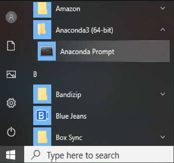
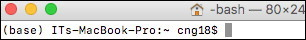

# Prerequisites

- **IN-CORE Account**
    A user must have an **IN-CORE** account. If you do not have it, see [IN-CORE Account](../account.md) section for setting one.

- **Virtual environment**
    We recommend that users get familiar with Python virtual environment managers called [Miniconda](https://docs.conda.io/en/latest/miniconda.html) 
    or [Anaconda](https://www.anaconda.com/).

    * These are tools that help keep code and its dependent libraries separate for different projects. If you decide, however, to use 
    a virtual environment or manager you must do it now, in this prerequisite step.

    * Environment managers are available by downloading operating system specific installers. Both, Miniconda and Anaconda 
    will include Python (Anaconda also includes a collection of over 1,500+ open source packages), 
    so installing Python first is not needed. The `conda` is the preferred interface for managing installations 
    and virtual environments with the Miniconda/Anaconda.

- `Python 3.9 or higher` <https://www.python.org/>
    It is common to have more than one Python version installed on your computer. Since we recommend using a virtual environment, your
    Python will be "encapsulated" by the environment with the version specified at the environment creation. Deleting the environment removes
    that particular Python. 
    If you install Miniconda/Anaconda, make sure you are running the correct version of Python, for example `/Users/<username>/anaconda3/bin/python`.
    
    The Python big picture: Most out-of-the-box [Windows installations](https://wiki.python.org/moin/BeginnersGuide/Download) do not come with Python pre-installed. On the other hand Mac OS and most 
    modern Linux distributions do have Python installed. However, the version 2.7 pre-installed by Apple is no longer supported (MacOS after 10.15 Catalina
    will not include a default system Python at all). It is common that users [download](https://www.python.org/downloads) and install newer or additional version of Python. 
    Therefore, it is always a good idea to check. Open Windows Powershell or Mac/Linux Terminal, and enter the following:
    ```
    python --version
    python3 --version
    ```
    If you have Python installed, it will report the version number and the command 
    ```
    which python
    ```
    shows path to Python which will be used.

- `Jupyter Notebook` <https://jupyter.org/>
    We recommend using Jupyter Notebook for running the **pyIncore** projects. It as an open-source application 
    that allows you to create projects (documents) that contain live Python code, visualizations and documentation. 
    Jupyter Notebook is already installed with Anaconda distribution; it has to be installed separately 
    in your virtual environment on Miniconda.

In the Installation section, we provide instructions for both environment managers starting with [Miniconda](https://docs.conda.io/en/latest/miniconda.html).
Similar instructions apply to full [Anaconda](https://docs.anaconda.com/anaconda/install/) manager. Python 3.x is installed with both versions. 
The following instructions were tested for Mac, Windows and Linux 64-bit OS.

## Windows 64-bit

1. Download the latest Miniconda3 installer for Windows from the [Miniconda](https://docs.conda.io/en/latest/miniconda.html) web page 
    or Anaconda3 installer from [Anaconda](https://www.anaconda.com/distribution/) page
    <br />
    <br />
2. Run the installer setup.

    Depending on the installation you might be asked to choose from different setups. 
    * Run the installer setup locally; select *Just Me* choice to avoid the need for administrator privileges. 
    * Leave the **default** folder path. For your information, the default path is `C:\Users\<username>\..\miniconda3` (`anaconda3`).
    * Do not add Anaconda to the PATH. Do, however, register Anaconda as the default Python environment.

3. Open up an Anaconda prompt from the Windows Start menu. The `base` environment is being activated and the prompt changes to: `(base) C:\Users\<user>`:

    


4. Create the python environment (for this example we choose `pyincoreEnv`) and activate it (or stay in the `base`):
    ```
    conda create -n pyincoreEnv python=3.9
    conda activate pyincoreEnv
    ```

5. Add [conda-forge](https://conda-forge.org/) package repository to your environment:
    ```
    conda config --add channels conda-forge
    ```

## Mac and Linux OS

1. Download the latest Miniconda3 installer from the [Miniconda](https://docs.conda.io/en/latest/miniconda.html) web page 
    or Anaconda3 installer from [Anaconda](https://www.anaconda.com/distribution/) page.
    <br />
    <br />
2. Run the installer setup.

    Depending on the installation you might be asked to choose from different setups. 
    * Run the installer setup locally (select the *Install for me only* on Mac/Linux) to avoid the need for administrator privileges.
    * Leave the default folder path. The path is `/Users/<username>/miniconda3` or `anaconda3` (`~/opt/` for the graphical install) on Mac, 
    and `/home/<username>/miniconda3` (`anaconda3`) on Linux.
    * Do not add Anaconda to the PATH. Do, however, register Anaconda as the default Python environment.

3. Open up a Terminal. The `base` environment is being activated and the prompt changes to: `(base)/Users/<username>` or `(base)/home/<username>`:

    
    
4. Create the python environment (for this example we choose `pyincoreEnv`) and activate it (or stay in the `base`):
    ```
    conda create -n pyincoreEnv python=3.9
    conda activate pyincoreEnv
    ```
    You should see `pyincoreEnv` in parentheses before the command prompt, meaning you set up the new virtual environment and are now using it.

5. Add [conda-forge](https://conda-forge.org/) package repository to your environment:
    ```
    conda config --add channels conda-forge
    ```
 