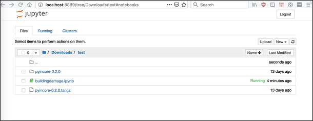
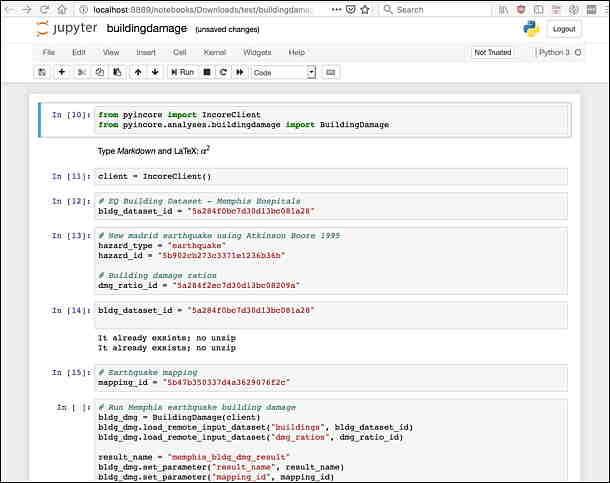

# Testing and Running

- We assume that users develop Python script by using pyIncore in their own **Project folder**.


- Install Jupyter Notebook. Jupyter Notebook is already installed with Anaconda distribution; it has to be installed separately in your virtual environment on Miniconda:
    ```
    conda install jupyter
    ```
  
- Download the **Building damage analysis** Jupyter Notebook (<https://github.com/IN-CORE/incore-docs/blob/main/notebooks/building_dmg.ipynb>)
and verify the installation by running it from your project folder. For details on running and manipulating `ipynb` files refer 
to [Jupyter documentation](https://jupyter.readthedocs.io/en/latest/running.html#running). If you have problems running Notebooks, contact us at [incore-dev@lists.illinois.edu](mailto:incore-dev@lists.illinois.edu).

- Start local **Jupyter Notebook** by running the following command at the terminal or command prompt from a **Project folder**. 
    ```
    jupyter notebook
    ```
       
    A message *The Jupyter Notebook is running* appears in the terminal/prompt and you should see the notebook open in your browser. 
    If the web browser doesn't open automatically, you can copy/paste the whole url with token into browser's navigation bar.
    
    
    
- Click on the `building_dmg.ipynb` in the Jupyter Notebook browser.

    


- Your web page should now show multiple cells of code. However, you are not actually running a notebook yet. Running 
a cell means that you will execute its content. To execute cells in order you can just select the first 
cell and click the **Run** button at the top.

    

    The **Building damage** is a long running analysis and there is little indication that it's running except 
    by either looking at the Jupyter Notebook file and seeing the [*] for the notebook cell where that block 
    of code is being executed or by looking at the Task Manager in the Notebook dashboard to see there is 
    a python process running. Alternatively, you can look at the Jupyter Notebook dashboard to see if the `csv` file 
    with results has been created yet.

For details of running and manipulating ipynb files refer to [Jupyter documentation](https://jupyter.readthedocs.io/en/latest/running.html#running).

- Additionally, a user can run Jupyter Notebook interactively in NCSA's [IN-CORE Lab](https://tools.in-core.org/hub/).
