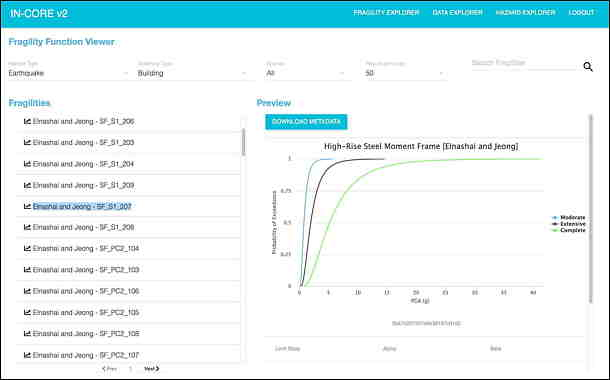

IN-CORE Web Tools
=================

**IN-CORE Web Tools** are for interacting with the service layer. They enable users to browse and search the **Datasets**, **Hazards** and **Fragilities**, view the metadata and visualizations, and download the datasets.

The In-Core Web Tools are a dashboard with viewers for various services. Currently these are **Fragility**, **Data** and **Hazard** services. The dashboard can be accessed directly at https://incore2.ncsa.illinois.edu/incore/ and on `IN-CORE Lab <incore_lab.html>`_
This section shows how to access IN-CORE Web Tools and documentations on IN-CORE Lab.

A user must login with IN-CORE username and password in order to access the viewers:

.. image:: images/wt0_login.jpg
    :height: 200px
    :width: 610px
    :scale: 100%
    :alt: IN-CORE Web Tools login page.
    :align: center

This section shows how to access IN-CORE Web Tools and documentations on IN-CORE Lab.

Fragility service
^^^^^^^^^^^^^^^^^

This is an example of a viewer showing a selection list (left) of Fragility curves.

Hazards and types of structures are selected in the pull down menus. The data can be downloaded in json format.

.. image:: images/wt1_fragility_menu.jpg
    :height: 240px
    :width: 610px
    :scale: 100%
    :alt: IN-CORE Web Tools fragility menu.
    :align: center

Hazard service
^^^^^^^^^^^^^^

Hazard service viewer.

.. image:: images/wt2_hazard.jpg
    :height: 380px
    :width: 610px
    :scale: 100%
    :alt: IN-CORE Web Tools hazard viewer.
    :align: center

Data service
^^^^^^^^^^^^

Data service viewer.

.. image:: images/wt3_data.jpg
    :height: 380px
    :width: 610px
    :scale: 100%
    :alt: IN-CORE Web Tools data viewer.
    :align: center

----

`IN-CORE home <index.html>`_
