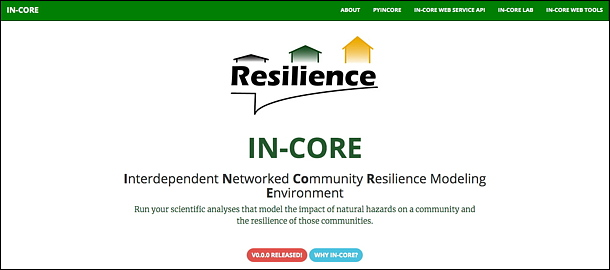
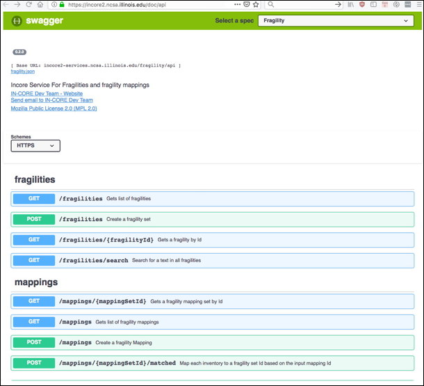

## Technical documentation

From the IN-CORE landing page at <https://incore2.ncsa.illinois.edu/> a user can access other services and documentations.

Documentation of IN-CORE’s Application programming interface
[API](https://en.wikipedia.org/wiki/Application_programming_interface) is
at https://incore2.ncsa.illinois.edu/doc/api/. The API endpoints definitions can be used for accessing **Fragility**,
**Data** and **Hazard** server(s) in development of new analyses.

** Contact NCSA

* Contact an individual programmer developer by email and copy <incore-dev@lists.illinois.edu> if you work closely with NCSA on a code conversion and/or improvement of your hazard analysis.
* Contact the <incore-dev@lists.illinois.edu> email list if you do not work directly with NCSA.